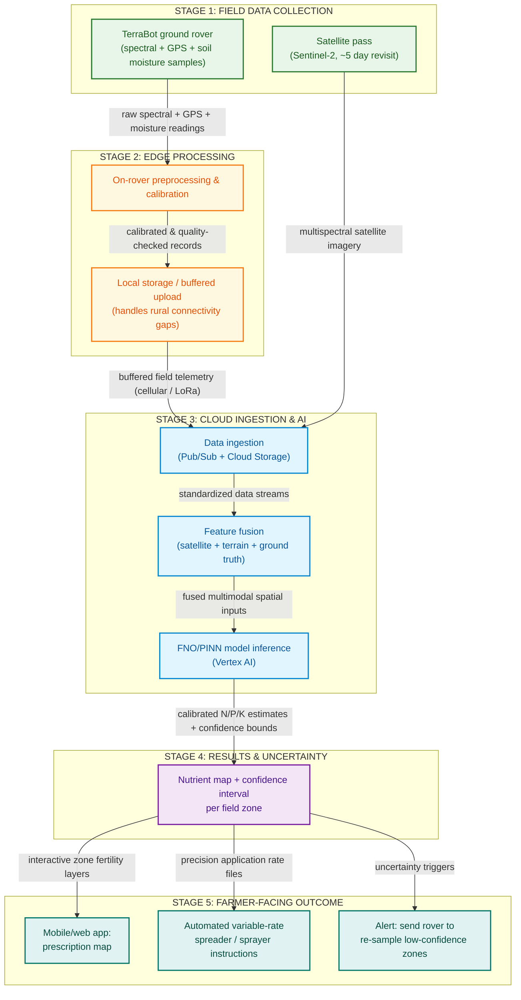

# Executive System Overview: End-to-End Architecture
_Last updated: 2026-09-09 · Status: reviewed_

## TL;DR
TerraScan v2 combines 5-day revisit satellite imagery with a low-cost autonomous field rover to produce precision soil nutrient maps (N, P, and K). By pairing edge-calibrated ground sensing with cloud-based AI feature fusion, the system delivers actionable variable-rate fertilizer prescriptions directly to farm equipment while quantifying uncertainty to prevent over-fertilization and environmental runoff.

## What we're trying to answer
1. How does raw observational data flow from low-Earth orbit satellites and ground rovers into actionable fertilizer application rates in a tractor cab?
2. What are the 5 core functional stages of the TerraScan v2 solution from an executive, non-technical perspective?
3. How does the system handle practical agricultural edge challenges like intermittent rural wireless connectivity and measurement uncertainty?

## End-to-End Solution Architecture

> *This is the 30-second view. See docs/figures/03_gcp_technical_architecture.md for the full technical pipeline and docs/figures/02b_robot_wiring.md for hardware detail.*

---

## Architecture Legend & Stage Color Key

| Stage | Stage Name | Visual Theme | Functional Role in Solution |
| :---: | :--- | :---: | :--- |
| **1** | **FIELD DATA COLLECTION** | 🟢 Sage Green | Captures optical and physical soil properties at macro (orbital) and micro (in-situ) scales. |
| **2** | **EDGE PROCESSING** | 🟡 Warm Amber | Standardizes reflectance on the rover and buffers telemetry locally during rural cellular blackouts. |
| **3** | **CLOUD INGESTION & AI** | 🔵 Azure Blue | Ingests data streams, fuses multimodal spatial layers, and runs physics-guided neural operators. |
| **4** | **RESULTS & UNCERTAINTY** | 🟣 Royal Purple | Delivers high-resolution N/P/K nutrient fields with distribution-free conformal confidence intervals. |
| **5** | **FARMER-FACING OUTCOME** | 🔷 Emerald / Teal | Translates data into mobile fertility maps, tractor sprayer files, and closed-loop re-sampling alerts. |

---

## The 30-Second Executive Walkthrough (How It Works)

### 1. Field Data Collection (The Eyes)
- **Satellite Pass (Sentinel-2, ~5 day revisit)**: European Space Agency satellites pass overhead every 5 days, providing free 10-meter resolution multispectral snapshots across entire agricultural regions.
- **TerraBot Ground Rover (spectral + GPS + soil moisture samples)**: An autonomous, solar-rechargeable ground robot navigates field rows, capturing proximal spectral scans, centimeter-precise RTK-GPS coordinates, and in-situ soil moisture measurements directly at the soil surface.

### 2. Edge Processing (The Local Filter)
- **On-Rover Preprocessing & Calibration**: The rover immediately calibrates raw photodiode readings against an internal 99% diffuse reflectance standard (PTFE), subtracting dark current noise and removing moisture distortion before transmission.
- **Local Storage / Buffered Upload (handles rural connectivity gaps)**: Because agricultural fields frequently suffer from cellular dead zones, the rover stores all processed records in onboard non-volatile memory and uploads buffered payloads automatically when an LTE/LoRaWAN connection is established.

### 3. Cloud Ingestion & AI (The Brain)
- **Data Ingestion (Pub/Sub + Cloud Storage)**: High-throughput cloud message queues and scalable storage securely receive and stage incoming satellite imagery tiles and rover telemetry payloads.
- **Feature Fusion (satellite + terrain + ground truth)**: Multi-temporal satellite bare-soil composites, 10-meter digital elevation terrain slopes (hydrological flowpaths), and calibrated rover point samples are aligned into a unified spatial tensor.
- **FNO/PINN Model Inference (Vertex AI)**: A 2D Fourier Neural Operator (FNO2d) estimates continuous spatial concentration fields for Nitrogen, Phosphorus, and Potassium, guided by physical mass conservation and hydrological transport laws.

### 4. Results & Uncertainty (The Quality Gate)
- **Nutrient Map + Confidence Interval per Field Zone**: Rather than outputting risky point estimates without error bars, the platform outputs calibrated 90% confidence intervals ($[\text{LowerBound}, \text{UpperBound}]$) for every field zone using split conformal prediction.

### 5. Farmer-Facing Outcome (The Action)
- **Mobile/Web App: Prescription Map**: Farmers view intuitive, colored nutrient availability zones on their phone, tablet, or browser dashboard.
- **Automated Variable-Rate Spreader / Sprayer Instructions**: Prescriptions are exported in industry-standard ISO-XML and Shapefile formats, plugging directly into tractor cab rate controllers to adjust fertilizer delivery on-the-fly.
- **Alert: Send Rover to Re-Sample Low-Confidence Zones**: When cloud cover, complex slopes, or anomalous soil patterns create high uncertainty in a specific zone, the system alerts the farmer and sends autonomous GPS re-sampling waypoints back to the rover.

---

> 💻 **Computer Science Translation**:
> - **Client / Edge Tier (Stages 1 & 2)**: Distributed IoT edge nodes (rovers) capturing asynchronous sensor streams, running local input validation/calibration, and maintaining an **offline-first write-ahead log** for intermittent network synchronization.
> - **Backend / Cloud Services (Stage 3)**: An event-driven message queue (`Pub/Sub`) feeding an ETL feature pipeline that joins satellite raster matrices with tabular spatial point telemetry, executed on a cloud neural operator inference cluster.
> - **Typed Schema with Bounded Error (Stage 4)**: The API returns a strongly-typed payload containing both the predicted variable $\hat{y}$ and an uncertainty bounding interval $[y_{\min}, y_{\max}]$ (analogous to a confidence rating on a promise).
> - **Actuation Consumers & Closed-Loop Retry Queue (Stage 5)**: Three downstream subscribers consume the output: a web frontend dashboard, an automated hardware bus controller (tractor CAN bus driver), and an asynchronous retry worker that queues re-sampling tasks for ambiguous telemetry.

---

## Confidence & Caveats
- **Executive vs. Technical Granularity**: This executive diagram deliberately abstracts low-level component pinouts, optical filters, and cloud container specifications so non-technical stakeholders can understand the full system within 30 seconds.
- **Companion Technical Blueprints**:
  - For full hardware pinouts, power distribution, and PCB design: see `docs/figures/02b_robot_wiring.md`.
  - For microservice containers, IAM permissions, Pub/Sub schema, and Cloud Run architecture: see `docs/figures/03_gcp_technical_architecture.md`.
  - For optical standardization physics: see [`hardware/sensor_calibration.md`](file:///Users/muthumano/Documents/WORK/code/personal_projects/terrascan_project/hardware/sensor_calibration.md).

## References
1. European Space Agency (ESA). (2025). *Sentinel-2 User Handbook*. ESA Communications.
2. Raissi, M., Perdikaris, P., & Karniadakis, G. E. (2019). Physics-informed neural networks: A deep learning framework for solving forward and inverse problems involving nonlinear partial differential equations. *Journal of Computational Physics*, 378, 686–707.
3. Li, Z., Kovachki, N., Azizzadenesheli, K., Liu, B., Bhattacharya, K., Stuart, A., & Anandkumar, A. (2021). Fourier neural operator for parametric partial differential equations. *ICLR 2021*.
4. USDA Natural Resources Conservation Service (NRCS). (2023). *Soil Fertility & Precision Nutrient Management Guidelines*. USDA Technical Note 190.
