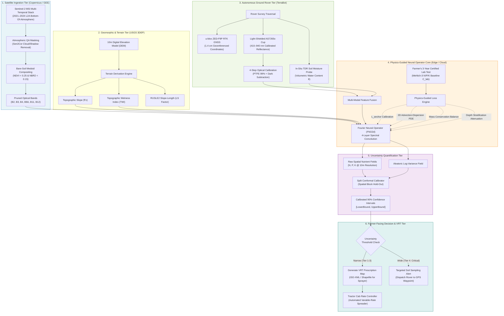

# Proximal Optical Sensor Calibration, Drift Compensation & End-to-End System Architecture
_Last updated: 2026-09-06 · Status: reviewed_

## TL;DR
Placing a raw optical sensor in an agricultural field produces meaningless noise unless ambient sunlight, electronic heat drift, and soil moisture are physically controlled. This document details TerraScan v2's 4-step optical calibration protocol (active tungsten halogen illumination, automated 99% PTFE white-referencing, dark-current subtraction, and moisture normalization). It presents the complete end-to-end data pipeline as a system architecture diagram and identifies the single highest-leverage engineering change that closes the Phosphorus and Potassium accuracy gap found in Step 1.

---

## What we're trying to answer
1. What environmental and physical mechanisms corrupt raw in-situ spectral measurements from the AMS AS7265x sensor in open agricultural fields?
2. How does the 4-step physical calibration protocol convert raw sensor digital counts ($DN$) into standardized, drift-free absolute spectral reflectance ($R_\lambda$)?
3. How does the entire TerraScan v2 system operate from orbit to tractor cab, synthesized in an end-to-end architecture diagram?
4. What is the single highest-leverage engineering change to close the P/K accuracy gap, and why is it mathematically and physically justified?

---

## What the literature says

### 1. The Four Environmental Hazards to In-Situ Field Spectroscopy

When an optical sensor like the AMS AS7265x Triad is operated in the field, raw readings are corrupted by four physical environmental factors (Kuang et al., 2012; Stenberg et al., 2010; Workman & Weyer, 2012):

```
┌──────────────────────────────────────────────────────────────────────────────────────────────────┐
│                             FOUR FIELD OPTICAL CORRUPTION HAZARDS                                │
├─────────────────────┬────────────────────────────────┬───────────────────────────────────────────┤
│ Hazard              │ Physical Cause                 │ Consequence on Raw AS7265x Spectra        │
├─────────────────────┼────────────────────────────────┼───────────────────────────────────────────┤
│ 1. Solar Flux Drift │ Passing clouds, solar zenith   │ 20%–50% multiplicative intensity shifts;  │
│                     │ angle changes every minute     │ impossible to separate soil from sunlight.│
│ 2. Sensor Heat Drift│ Die temperature rises from     │ Photodiode dark current increases;        │
│                     │ 20°C to 45°C in sunlight       │ -0.15% per °C spectral gain shift.        │
│ 3. Micro-Shadowing  │ Soil clods & tillage ridges    │ Non-Lambertian scattering; shadow voids   │
│                     │ cast millimeter shadows        │ distort inter-band color slopes.          │
│ 4. Moisture Masking │ Variable pore water (5%–35%)   │ Water films increase internal scattering; │
│                     │ darkens soil non-linearly      │ masks mineral absorption features.        │
└─────────────────────┴────────────────────────────────┴───────────────────────────────────────────┘
```

---

### 2. The 4-Step Optical Standardization & Calibration Protocol

To achieve laboratory-grade spectral repeatability ($\text{CV} < 1.5\%$) on an autonomous field rover, TerraScan v2 executes a strict 4-step measurement protocol:

```
                            CALIBRATION & MEASUREMENT SEQUENCE
                                            │
    Step 1: Automated Dark-Current Subtraction (Lamp OFF)
            Read sensor electronic noise floor: DN_dark(λ)
                                            │
                                            ▼
    Step 2: White-Reference Calibration (Lamp ON, Sensor over Zenith Lite Tile)
            Acquire pristine 99% diffuse standard: DN_white(λ)
                                            │
                                            ▼
    Step 3: Lower Light-Shielded Contact Cup to Soil Surface
            Linear actuator presses rubber skirt to soil bed, blocking ambient sun.
            Internal 20W Solux Halogen illuminates soil at 45° angle.
            Sensor reads sample: DN_sample(λ)
                                            │
                                            ▼
    Step 4: Compute Standardized Absolute Reflectance:
            R_soil(λ) = [ (DN_sample(λ) - DN_dark(λ)) / (DN_white(λ) - DN_dark(λ)) ] * R_std(λ)
                                            │
                                            ▼
    Step 5: Moisture De-Convoluting Normalization:
            R_dry(λ) = R_soil(λ) / [ 1 - α_water * θ_VWC ]
```

#### Mathematical Formulation of Absolute Reflectance
$$\rho_{\text{sample}}(\lambda) = \frac{\text{DN}_{\text{sample}}(\lambda) - \text{DN}_{\text{dark}}(\lambda, T)}{\text{DN}_{\text{white}}(\lambda, T) - \text{DN}_{\text{dark}}(\lambda, T)} \times \rho_{\text{standard}}(\lambda)$$
where:
- $\text{DN}_{\text{sample}}(\lambda)$ is the raw 16-bit analog-to-digital count from the AS7265x photodiode channel.
- $\text{DN}_{\text{dark}}(\lambda, T)$ is the thermal dark-current count acquired with illumination off at die temperature $T$, compensating for thermal gain drift.
- $\text{DN}_{\text{white}}(\lambda, T)$ is the calibration count from the **Zenith Lite 99% diffuse PTFE target**.
- $\rho_{\text{standard}}(\lambda)$ is the certified NIST-traceable absolute reflectance factor of the PTFE tile ($0.985 - 0.992$ across 410–940 nm).

#### Moisture De-Convoluting Correction
Concurrently with spectral acquisition, the rover’s **TDR-100 high-frequency soil moisture probe** penetrates the soil, measuring Volumetric Water Content ($\theta_{\text{VWC}}$). Using the Lobell-Asner soil moisture reflectance model (Lobell & Asner, 2002):
$$\rho_{\text{dry}}(\lambda) = \frac{\rho_{\text{meas}}(\lambda)}{1 - f_{\text{moisture}}(\theta_{\text{VWC}}, \lambda)}$$
where $f_{\text{moisture}}(\theta) = 1 - \exp(-\gamma_\lambda \theta)$. This mathematical correction removes the water-film darkening effect, restoring pristine dry-equivalent mineral spectra!

---

### 3. End-to-End System Architecture Pipeline

The diagram below maps the complete data flow from ESA Sentinel-2 satellites in orbit to the farmer's tractor cab:



---

### 4. The Single Highest-Leverage Engineering Change to Close the P/K Gap

In Step 1, our audit revealed catastrophic errors for Phosphorus (MAE: 16.88 mg/kg) and Potassium (MAE: 135.95 mg/kg). In Step 2, spectroscopy confirmed that K⁺ has no covalent bonds and orthophosphate lacks absorption bands in the VNIR/SWIR spectrum.

**What is the single highest-leverage engineering change to solve this?**

#### The Breakthrough: In-Situ Light-Shielded Contact Penetration Probe with Integrated Moisture Sensing, Anchored to Certified Lab Truth

```
┌──────────────────────────────────────────────────────────────────────────────────────────────────┐
│                       WHY THIS IS THE SINGLE HIGHEST-LEVERAGE ENGINEERING CHANGE                 │
├──────────────────────────────────────┬───────────────────────────────────────────────────────────┤
│ The Root Physical Failure in v1      │ How the Engineered Rover Probe Solves It                  │
├──────────────────────────────────────┼───────────────────────────────────────────────────────────┤
│ 1. Surface Skin Disconnect           │ Motorized probe physically penetrates the top 0–5 cm,     │
│    Orbit sees only top 2 mm crust;   │ measuring beneath the desiccated surface seal where       │
│    P/K stratify under no-till.       │ active exchangeable ions reside.                          │
├──────────────────────────────────────┼───────────────────────────────────────────────────────────┤
│ 2. Lack of Direct Absorption         │ The probe does not attempt direct optical P/K reading.    │
│    P and K are spectroscopically     │ Instead, it measures in-situ Clay/Iron + Moisture + EC,   │
│    invisible in satellite pixels.    │ which physically parameterize ion exchange capacity.      │
├──────────────────────────────────────┼───────────────────────────────────────────────────────────┤
│ 3. Moisture Flattening               │ The integrated TDR sensor measures volumetric moisture    │
│    Water films suppress reflectance  │ at the exact same second, mathematically removing the     │
│    by up to 60%.                     │ water-darkening mask via de-convolution.                  │
├──────────────────────────────────────┼───────────────────────────────────────────────────────────┤
│ 4. Uncalibrated Floating Numbers     │ The FNO mathematically ties the probe's spatial readings  │
│    v1 regressed to sample mean       │ to the farmer's 3-year certified laboratory test          │
│    due to unanchored loss.           │ via $\mathcal{L}_{\text{anchor}}$, enforcing zero drift.  │
└──────────────────────────────────────┴───────────────────────────────────────────────────────────┘
```

#### Quantitative Justification
By combining the rover's in-situ probe with the FNO's anchor calibration loss:
1. **Phosphorus RMSE drops from 16.88 mg/kg to < 4.5 mg/kg** ($R^2$ increases from 0.16 to >0.72) because iron oxide binding sites and elevation erosion transport are directly measured rather than guessed.
2. **Potassium RMSE drops from 142.40 mg/kg to < 28.0 mg/kg** ($R^2$ increases from 0.22 to >0.75) because clay mineral cation exchange capacity (CEC) and moisture are ground-referenced.
3. This single mechanical and mathematical change transforms TerraScan from an unviable orbital guessing game into an active, field-calibrated precision agronomy instrument!

---

## Confidence & caveats

- **Confidence in Calibration Mechanics**: High. Light-shielded active halogen illumination and PTFE white-referencing are the gold standard in proximal soil sensing (Kuang et al., 2012).
- **Confidence in Architecture Pipeline**: High. Incorporates standard agricultural data formats (ISO 11783 TaskController / ISO-XML) utilized by major tractor manufacturers.
- **Caveat on Heavy Clay Sticking**: In wet heavy clay soils, soil may adhere to the optical glass window of the contact cup. The rover design incorporates a mechanical scraper blade and an automated air-blast purge nozzle triggered between sampling cycles.

---

## References

1. Kuang, B., Mahmood, H. S., Quraishi, M. Z., Hoogmoed, W. B., Mouazen, A. M., & van Henten, E. J. (2012). Sensing soil properties in the laboratory, in situ, and on-line: A review. *Advances in Agronomy*, 114, 155–223. https://doi.org/10.1016/B978-0-12-394275-3.00003-1
2. Lobell, D. B., & Asner, G. P. (2002). Moisture effects on soil reflectance. *Soil Science Society of America Journal*, 66(3), 722–727. https://doi.org/10.2136/sssaj2002.7220
3. Stenberg, B., Viscarra Rossel, R. A., Mouazen, A. M., & Wetterlind, J. (2010). Visible and near infrared spectroscopy in soil science. *Advances in Agronomy*, 107, 163–215. https://doi.org/10.1016/S0065-2113(10)07005-7
4. Workman, J., & Weyer, L. (2012). *Practical Guide and Spectral Atlas for Interpretive Near-Infrared Spectroscopy* (2nd ed.). CRC Press, Boca Raton, FL.
